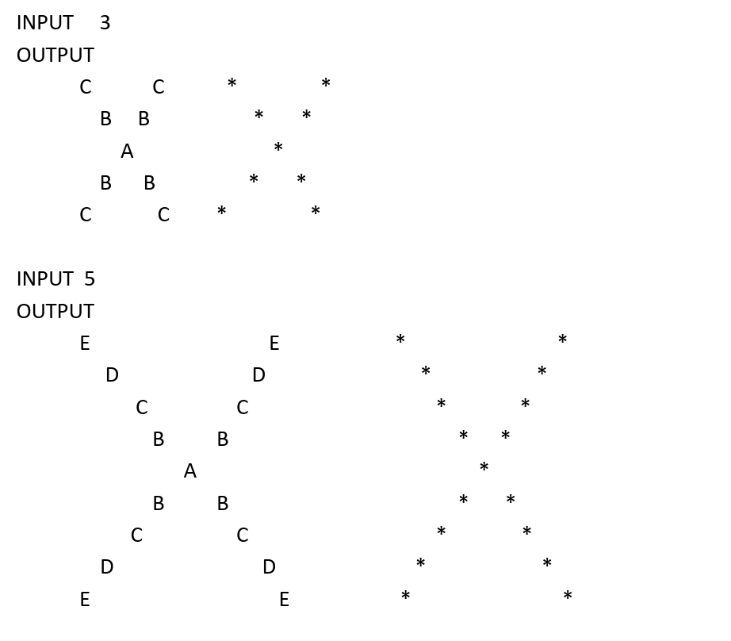

## Four-Windmill Pattern

This problem draws a 4-direction windmill pattern using letters and `*` characters.

Given an integer **N**, the program uses the first **N** uppercase English letters in descending order (for example, N=3 uses C, B, A) and places them diagonally to form a windmill. The letter `A` is always the center.

A second windmill made of `*` characters is also drawn, positioned at a fixed distance from the first windmill.

---

### Input  
One integer **N** $\((1 \le N \le 20)\)$

---

### Output  
Print two 4-direction windmill patterns:  
one made of letters and one made of `*`, arranged according to the given examples.

---

### Examples  

