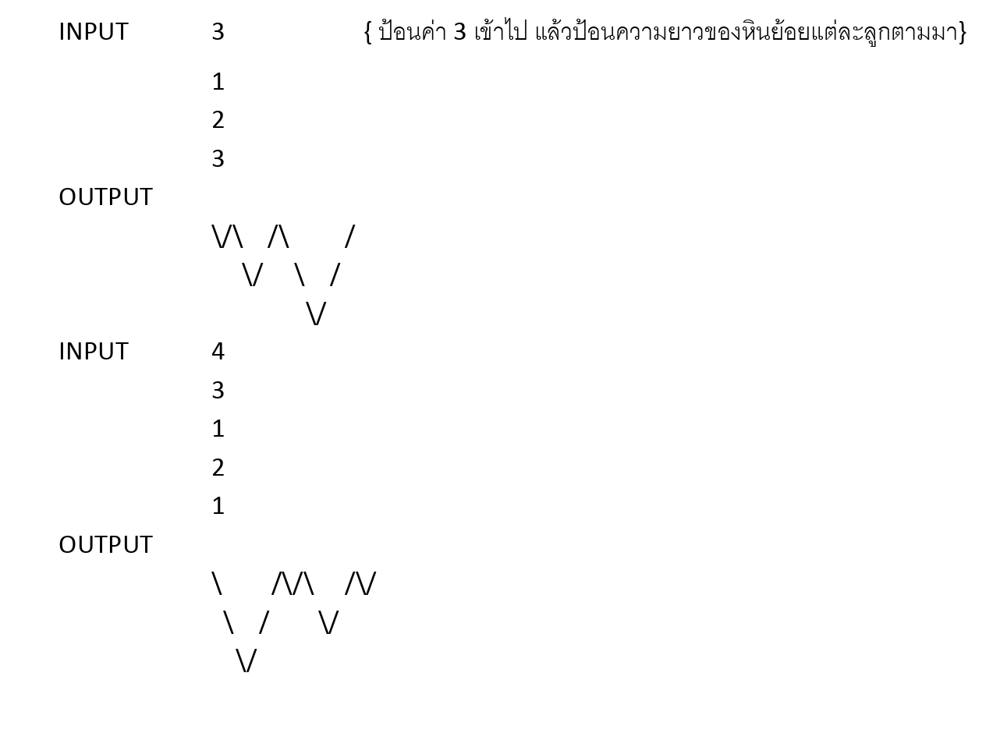

## หินย้อย

หินงอก คือ หินที่งอกจากพื้น และ หินย้อย คือหินที่ย้อยลงมาจากด้านบน เกิดมากโดยเฉพาะภูเขาหินปูน  
จงเขียนโปรแกรมนำอักขระ ‘\’ และ ‘/’ มาพิมพ์เป็นรูปหินย้อย ตำมลักษณะที่กำหนด โดยให้ป้อนอินพุตเป็นตัวเลข  
ค่าแรกเป็นจำนวนลูกของหินย้อย ส่วนค่าที่ตามมาแต่ละบรรทัดเป็นควำมยำวของหินย้อยแต่ละลูก โดยหินย้อยแต่ละลูกจะนำเชิงเขามาติดกัน  
โดยจำนวนลูกของหินย้อยเป็นจำนวนเต็มที่มีค่าไม่เกิน 20  
ส่วนความยาวของหินย้อยเป็นเลขจำนวนเต็มมีค่าไม่เกิน 15

---

### ข้อมูลนำเข้า  
บรรทัดแรก เป็นจำนวนเต็ม แสดงจำนวนลูกของหินย้อย (ไม่เกิน 20)  
บรรทัดถัดมาแต่ละบรรทัด เป็นจำนวนเต็ม แสดงความยาวของหินย้อยแต่ละลูก (ไม่เกิน 15)

---

### ข้อมูลส่งออก  
พิมพ์รูปหินย้อยด้วยอักขระ ‘\’ และ ‘/’ ตามลักษณะที่กำหนด

---

### ตัวอย่าง  

---
