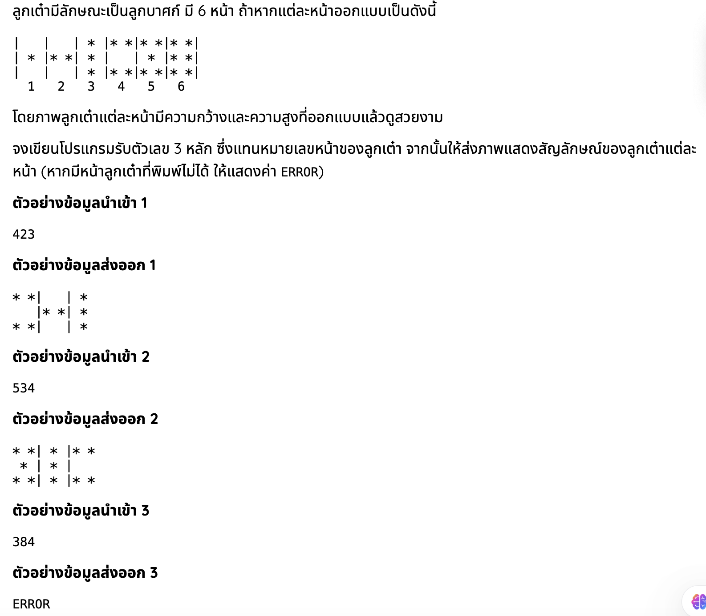

## ลูกเต๋า (10 คะแนน)

ลูกเต๋ามีลักษณะเป็นลูกบาศก์ มี 6 หน้า  
โดยแต่ละหน้าออกแบบเป็นรูปสัญลักษณ์ดังนี้

(แสดงรูปหน้าลูกเต๋าตามภาพโจทย์)

จงเขียนโปรแกรมรับตัวเลข 3 หลัก ซึ่งแทนหมายเลขหน้าของลูกเต๋า  
จากนั้นให้แสดงสัญลักษณ์ของแต่ละหน้าตามลำดับที่กำหนด

บรรทัดแรกเป็นข้อมูลอินพุตเลข 3 หลัก  
บรรทัดถัดไปเป็นการแสดงหน้าลูกเต๋า  
โดยแต่ละหน้าจะถูกคั่นด้วยเครื่องหมาย `|`

---

### ข้อมูลนำเข้า  
มีบรรทัดเดียว เป็นตัวเลขจำนวนเต็ม 3 หลัก  
โดยแต่ละหลักแทนหมายเลขหน้าของลูกเต๋า

---

### ข้อมูลส่งออก  
แสดงรูปหน้าลูกเต๋าตามลำดับ  
ถ้าข้อมูลนำเข้าไม่ถูกต้อง ให้แสดงคำว่า `ERROR`

---

### ตัวอย่าง  

